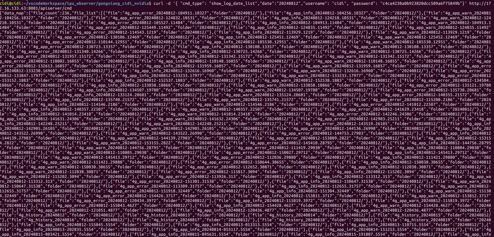
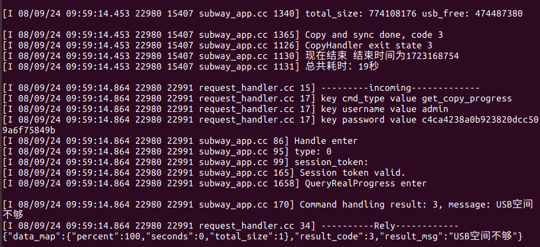
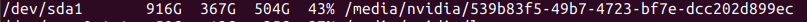
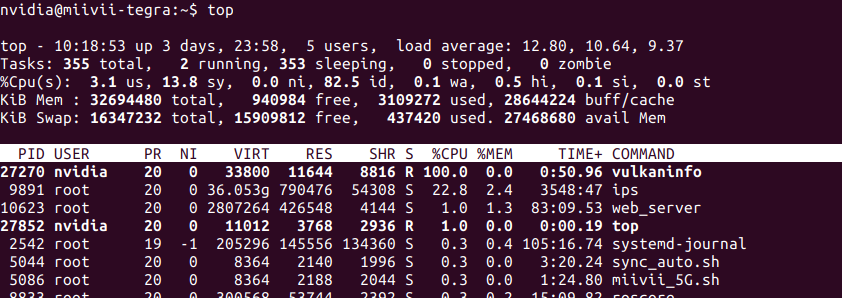

# IPU_WEB_SERVER新增功能与权限梳理
## 目录
1. [权限管理](#权限)

2. [用户管理](#用户管理)
 
3. [录像与日志文件显示](#录像日志文件显示)

4. [录像与日志文件拷贝](#录像日志文件拷贝)

5. [查询拷贝状态](#查询拷贝状态)

6. [状态查询](#查询状态)

7. [标定](#标定)

8. [更新](#更新)

9. [导入](#导入)

10. [总结](#总结)


## 权限
### 用户信息

| 功能  | ADMIN | CIDI |
| :--: | :--: | :--: |
| 登录 |  1  | 1 |
| 注册 |  1  | 1 |
| 删除 |  1  | 0 |
| 修改密码 |  1  | 0 |

### 录像与日志拷贝
| 功能  | ADMIN | CIDI |
| :--: | :--: | :--: |
| 录像查询| 1  |  1  |
| 录像拷贝usrdisk |  `./bag/ ./camera/full ./camera/key ` |  `./camera/full ./camera/key` |
| 录像拷贝Internaldisk |  `./bag/ ./camera/full ./camera/key `  | 0 |
| 日志拷贝usrdisk | `/ips/` `/lte/` | `/ips/` `/lte/` |
| 日志拷贝Internaldisk | `/ips/` `/lte/` | 0 |


## 用户管理
#### Handle
- 识别客户端类型：`ADMIN` `CIDI`
- 获取会话令牌：`session_token`
- 验证会话令牌：
  - 如果`令牌无效`，检查是否注册，如果未注册且不是注册指令，返回提示注册
  - 如果用户未注册是注册指令，调用Register进行注册
  - 如果用户已注册是登录指令，调用Login进行登录
- 根据客户端类型调用相应的PickHandle函数处理指令。（此处都是同一个PickHandle函数，如果后续进行权限控制，可以从这修改）
```cpp
    //处理命令
    if(CLIENT_UNKNOWN == type) {
      AINFO << "Handling as CLIENT_UNKNOWN.";
      code = PickHandle(cmd, map, out_msg);
    } else if(CLIENT_ADMIN == type) {
      AINFO << "Handling as CLIENT_ADMIN.";
      //TODO
      code = PickHandle(cmd, map, out_msg);
    } else if(CLIENT_CIDI == type) {
      AINFO << "Handling as CLIENT_CIDI.";
      //TODO
      code = PickHandle(cmd, map, out_msg);
    }
```

#### IdentifyClient
- 内置admin 为 `CLIENT_ADMIN`， 新注册的用户默认设置为 `CLIENT_CIDI`

#### Login
```Json
curl -d '{ "cmd_type": "login", "username": "cidi", "password": "c4ca4238a0b923820dcc509a6f75849b"}' http://172.16.133.63:8081/apiserver/cmd

{"data_map":{"role":"CLIENT_CIDI"},"result_code":0,"result_msg":"Login successful."}

```

#### Register
```Json
curl -d '{ "cmd_type": "register", "username": "cidi", "password": "c4ca4238a0b923820dcc509a6f75849b","new_username": "new_uesr", "new_password": "7096574cebeb85403bd77a8f6cbe151f"}' http://172.16.133.63:8081/apiserver/cmd

{"data_map":"{}","result_code":0,"result_msg":"Registration successful."}
```

#### ResetPassword
```Json
curl -d '{ "cmd_type": "reset_password", "username": "new_user", "password": "7096574cebeb85403bd77a8f6cbe151f","new_password":"21f3d99c69e2f2fe16d29a04846bc1ed" }' http://172.16.133.63:8081/apiserver/cmd

{"data_map":"{}","result_code":0,"result_msg":"Password has been reset successfully."}
```

#### DeleteUser
```Json
curl -d '{ "cmd_type": "delete_user", "username": "admin", "password": "c4ca4238a0b923820dcc509a6f75849b","delete_username":"user"}' http://172.16.133.63:8081/apiserver/cmd
{"data_map":"{}","result_code":0,"result_msg":"User has been deleted successfully."}

```

#### DisplayAllUsers
```Json
 curl -d '{ "cmd_type": "display_all_users", "username": "admin", "password": "c4ca4238a0b923820dcc509a6f75849b"}' http://172.16.133.63:8081/apiserver/cmd

{"data_map":
  {"total_user_count":7,
    "users":[
        {"username":"admin"},
        {"username":"cidi"},
        {"username":"new_uesr"},
        {"username":"new_uesr1"},
        {"username":"new_user"},
        {"username":"test"},
        {"username":"zy"}]},
  "result_code":0,"result_msg":"User list retrieved successfully."}


```


## 录像日志文件显示


#### GetRecordDateList 和 GetLogDateList
- 列出有录像或日志文件的日期的列表
- 录像： /bag/  /camera/full/  /camera/key/
- 日志: /ips/  /lte/
  ```cpp
    函数一：0/1表示flag
    RecordLog(type, root_path, size, free_size, vec, 0);
    if (CLIENT_ADMIN == client_type) {
      RecordLog(type, root_path, size, free_size, vec, 1);
    }

    函数二：0/1表示yy
    if(flag == 1){
      GetCopyDateList(root_path + "/bag/", 0, vec);
    }
    GetCopyDateList(root_path + "/camera/full/", 0, vec);
    GetCopyDateList(root_path + "/camera/key/", 1, vec);

    函数三：
    if (1 == yy) item.type = "alarm"; 
    else item.type = "time";
  ```

#### 显示时间范围内的录像文件

- ***ShowRecordDateList***
  ：显示某一天的全部录像文件(`.avi` `.jpg`)
  ```
  curl -d '{ "cmd_type": "show_record_date_list","date":"20221215","page_size":"10","page_number":"1","username": "cidi", "password": "c4ca4238a0b923820dcc509a6f75849b"}' http://172.16.133.63:8081/apiserver/cmd
  
  {"data_map":{"current_page":1,"file_count":1554,"file_list":[{"file":"20221215143232667.res.avi","folder":"20221215//.res"},{"file":"20221215161434301.res.avi","folder":"20221215//.res"},{"file":"20221215161734485.res.avi","folder":"20221215//.res"},{"file":"20221215162034697.res.avi","folder":"20221215//.res"},{"file":"20221215162334937.res.avi","folder":"20221215//.res"},{"file":"20221215162635117.res.avi","folder":"20221215//.res"},{"file":"20221215162935344.res.avi","folder":"20221215//.res"},{"file":"20221215163235552.res.avi","folder":"20221215//.res"},{"file":"20221215163535759.res.avi","folder":"20221215//.res"},{"file":"20221215163835964.res.avi","folder":"20221215//.res"}],"total_pages":156},"result_code":0,"result_msg":"Query success"}

  ```

- ***ShowRecordDateListWithoutJPG***
  ：显示某一天的全部录像文件( `.avi`)

- ***ShowRecordDateListWithTimeFilter***
  : 显示某一天一个时间段的全部录像文件(`.avi` `.jpg`)
  ```
  curl -d '{ "cmd_type": "show_record_date_list_range","date":"20221215190000|20221215190200","page_size":"10","page_number":"1","username": "cidi", "password": "c4ca4238a0b923820dcc509a6f75849b"}' http://172.16.133.63:8081/apiserver/cmd

  {"data_map":{"current_page":1,"file_count":6,"file_list":[{"file":"20221215190029716.near.avi","folder":"20221215//6mm"},{"file":"20221215190129708.near.avi","folder":"20221215//6mm"},{"file":"20221215190000031.jpg","folder":"20221215//6mm"},{"file":"20221215190030028.jpg","folder":"20221215//6mm"},{"file":"20221215190100026.jpg","folder":"20221215//6mm"},{"file":"20221215190130024.jpg","folder":"20221215//6mm"}],"total_pages":1},"result_code":0,"result_msg":"Query success"}

  ```

- ***ShowRecordDateListWithoutJPGWithTimeFilter***
  : 显示某一天一个时间段的全部录像文件(`.avi`)

- ***ShowLogDateList***:显示某一天的日志文件
  ```
  curl -d '{ "cmd_type": "show_log_date_list","date":"20240812","page_size":"10","page_number":"1","username": "cidi","password":"c4ca4238a0b923820dcc509a6f75849b"}' http://172.16.133.63:8081/apiserver/cmd


  {"data_map":{"current_page":1,"file_count":236,"file_list":[{"file":"4g_app_error_20240812-104911.10327","folder":"20240812/"},{"file":"4g_app_info_20240812-104256.10327","folder":"20240812/"},{"file":"4g_app_warn_20240812-104256.10327","folder":"20240812/"},{"file":"4g_app_error_20240812-124832.10531","folder":"20240812/"},{"file":"4g_app_info_20240812-124218.10531","folder":"20240812/"},{"file":"4g_app_warn_20240812-124218.10531","folder":"20240812/"},{"file":"4g_app_error_20240812-105527.11484","folder":"20240812/"},{"file":"4g_app_info_20240812-104913.11484","folder":"20240812/"},{"file":"4g_app_warn_20240812-104913.11484","folder":"20240812/"},{"file":"4g_app_error_20240812-125449.11492","folder":"20240812/"}],"total_pages":24},"result_code":0,"result_msg":"Query success"}

  ```
  
  
  #### 对应指令
  - HANDLE_CMD("get_record_date_list", GetRecordDateList);
  - HANDLE_CMD("get_log_date_list", GetLogDateList);
  - HANDLE_CMD("show_record_date_list", ShowRecordDateList);
  - HANDLE_CMD("show_record_date_list_noJPG"，  ShowRecordDateListWithoutJPG);
  - HANDLE_CMD("show_record_date_list_range", ShowRecordDateListWithTimeFilter);
  HANDLE_CMD("show_record_date_list_range_noJPG" ,ShowRecordDateListWithoutJPGWithTimeFilter);
  - HANDLE_CMD("show_log_date_list", ShowLogDateList);
  
## 录像日志文件拷贝
- ***RecordDateCopy*** 
  - 拷贝逻辑
    - 将单线程拷贝修改为多线程按批次拷贝，每个线程拷贝数量由`batchsize`设置
  - 拷贝权限
    - 修改`admin`身份和`cidi`的拷贝权限。且默认只拷贝`/6mm/` 和隐藏目录`/.res/` 中`.avi `和 `.mp4`结尾的数据

- ***LogDateCopy***
- ***QueryCopyProgress 和 QueryLogCopyProgress***


  #### 对应指令
  - HANDLE_CMD("record_range_copy", RecordDateCopy);
  - HANDLE_CMD("log_date_copy", LogDateCopy);
  - HANDLE_CMD("get_copy_progress", QueryCopyProgress);
  - HANDLE_CMD("get_log_copy_progress", QueryLogCopyProgress);



## 查询拷贝状态
- 已拷贝文件数/总拷贝文件数 来描述进度
- 设置不同的interval值，优化查询时间
- 用完成进度所消耗的时间粗略估计需要拷贝完成的总时间
  - 初始是100ms
  - 大于10s 500ms
  - 大于30s 1000ms
  - 大于60s 2000ms
  ```cpp
  cidi@cidi:~/vscodeWorkspace/ipu_wbserver/ipu_web_server_arm$ curl -d '{"cmd_type":"get_copy_progress","username":"admin","password":"c4ca4238a0b923820dcc509a6f75849b"}' http://172.16.133.63:8081/apiserver/cmd

  {"data_map":  
    { 
      "copied_files":25,
      "estimated_remaining_time":16,
      "interval":500,
      "percent":62,
      "seconds":27,
      "total_files":40
    }
  ,"result_code":0,"result_msg":"正在拷贝"}
  ```

## 查询状态
  权限没有区别
- 设备状态
- 传感器信息
- 内部接口信息
- 外部接口信息
- 本机版本信息

## 标定
  权限没有区别
## 更新
  权限没有区别

## 导入
  权限没有区别
- 模型导入
- 地图导入
- 参数导入

## 总结
### 已解决
- 用户信息登录注册退出等功能实现；
- 重构了录像和日志拷贝代码，拷贝的逻辑，实习的细节，内存空间的查询。在同样的拷贝任务中，（以20221215这天录像为例），拷贝时间提升了1/4；

### 遗留问题
- `admin`用户拷贝录像时，有些bag包里面的数据非常大，同时还需要拷贝`internaldisk`和`usrdisk`两份，容易出现负载过大导致服务器错误；

  - load average: 平均负载值非常高，系统在处理大量任务。一般情况下，负载平均值超过系统CPU核心数时可能处于过载状态。
  - CPU：CPU大部分时间空闲，82.5% idle， 可能是很多I/O操作或等待中的进程导致高负载，而不是CPU密集型任务。  
- U盘离线升级完成后web页面显示接口超时


升级问题
```
nvidia@miivii-tegra:/tmp/C22T01013-IPS_G_v1.3.0_01$ bash update.sh
Traceback (most recent call last):
  File "update.py", line 289, in <module>
    logger = get_logger('/tmp/ota.log')
  File "update.py", line 23, in get_logger
    handler_file = logging.FileHandler(filename=log_name)
  File "/usr/lib/python3.6/logging/__init__.py", line 1032, in __init__
    StreamHandler.__init__(self, self._open())
  File "/usr/lib/python3.6/logging/__init__.py", line 1061, in _open
    return open(self.baseFilename, self.mode, encoding=self.encoding)
PermissionError: [Errno 13] Permission denied: '/tmp/ota.log'
Exception at line 18!

```


```
nvidia@miivii-tegra:/tmp/C22T01013-IPS_G_v1.3.0_01$ python3 update.py 
Traceback (most recent call last):
  File "update.py", line 289, in <module>
    logger = get_logger('/tmp/ota.log')
  File "update.py", line 23, in get_logger
    handler_file = logging.FileHandler(filename=log_name)
  File "/usr/lib/python3.6/logging/__init__.py", line 1032, in __init__
    StreamHandler.__init__(self, self._open())
  File "/usr/lib/python3.6/logging/__init__.py", line 1061, in _open
    return open(self.baseFilename, self.mode, encoding=self.encoding)
PermissionError: [Errno 13] Permission denied: '/tmp/ota.log'
```

sudo unzip -o -d /tmp/ /media/nvidia/539b83f5-49b7-4723-bf7e-dcc202d899ec/ips_update/ips_fw.zip 

bash ./C*T0*/update.sh

 cat /tmp/.fw_up_code

 定位问题：
 /tmp/C22T01013-IPS_G_v1.3.0_01/ips_2024040999999/scripts/ota_update.sh